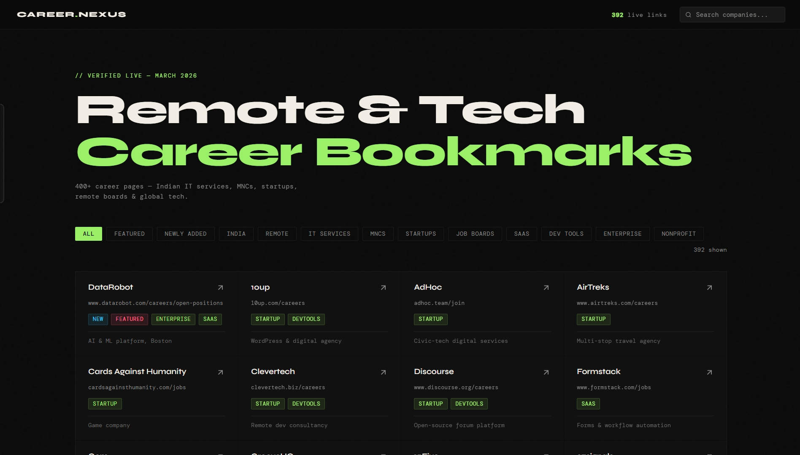

# 🔖 Career.Nexus — 400+ Live Job & Career Pages

<div align="center">


**A curated, searchable, single-file HTML bookmark page with 400+ verified live career & job pages.**  
Indian IT services · Global MNCs · Unicorn Startups · Remote Job Boards · Fresher Portals

[🌐 Live Demo](https://careernexuss.vercel.app/) &nbsp;·&nbsp; [📂 View File](./index.html) &nbsp;·&nbsp; [⭐ Star this repo](#)

</div>

---

## 📸 Preview



---

## ✨ Features

- 🔍 **Instant Search** — Filter by company name or description in real-time
- 🏷️ **Smart Filters** — 13 categories including India, Remote, MNCs, IT Services, Startups, SaaS, Dev Tools
- 🃏 **Card Layout** — Clean grid of clickable cards, each opening the career page in a new tab
- 🌑 **Dark Theme** — Eye-friendly dark UI with accent highlights
- 📱 **Responsive** — Works on desktop, tablet, and mobile
- ⚡ **Zero Dependencies** — Pure HTML, CSS & vanilla JS — no npm, no build step, no backend
- 🗂️ **Single File** — Everything in one `index.html` — download and open locally

---

## 📦 What's Inside

| Category | Count | Description |
|---|---|---|
| 🇮🇳 Indian IT Services | 27+ | TCS, Infosys, Wipro, HCLTech, Cognizant, Accenture, LTIMindtree... |
| 🏢 Global MNCs (India offices) | 60+ | Amazon, Microsoft, Google, Adobe, Cisco, Intel, Salesforce, SAP... |
| 🦄 Indian Startups & Unicorns | 100+ | Swiggy, Zomato, Razorpay, CRED, Zepto, Groww, Zerodha, Ola, Meesho... |
| 🌐 Remote Job Boards | 35+ | RemoteOK, Remotive, FlexJobs, We Work Remotely, Turing, Arc.dev... |
| 📋 Indian Job Portals | 20+ | Internshala, Shine, Foundit, Superset, AccioJob, Freshersworld... |
| 💼 Global Tech Career Pages | 100+ | GitHub, Figma, GitLab, Docker, HashiCorp, Atlassian, Stripe... |
| 🏦 Finance & Banking | 20+ | Goldman Sachs, JPMorgan, Zerodha, Groww, Razorpay, HDFC... |
| 🚀 Space & Deep Tech | 5+ | Agnikul, Skyroot, Pixxel, Sarvam AI, Krutrim... |

---

## 🚀 Usage

### Option 1 — Open Directly
```bash
# Clone the repo
git clone https://github.com/VarunB453/Career.Nexus.git

# Open in browser
open index.html
# or just double-click the file
```

### Option 2 — Host on GitHub Pages
1. Fork this repository
2. Go to **Settings → Pages**
3. Set source to **main branch / root**
4. Visit `https://github.com/VarunB453/Career.Nexus/index.html`

### Option 3 — Use as Browser Bookmark
- Open `bookmarks.html` in your browser
- Bookmark the tab as your **speed dial / new tab**

---

## 🏷️ Filter Categories

| Filter | What it shows |
|---|---|
| `Featured` | Hand-picked must-visit pages |
| `India` | India-based companies & portals |
| `Remote` | Remote-first companies & boards |
| `IT Services` | Indian IT service companies |
| `MNCs` | Global multinationals with India offices |
| `Startups` | Funded startups & unicorns |
| `Job Boards` | Aggregator & job search platforms |
| `SaaS` | Software-as-a-Service companies |
| `Dev Tools` | Developer-focused tools & platforms |
| `Enterprise` | Large established enterprises |
| `Nonprofit` | NGOs & social-impact organisations |

---

## 🔗 Highlighted Companies

<details>
<summary><b>🇮🇳 Indian IT Services</b></summary>

| Company | Link |
|---|---|
| TCS | https://ibegin.tcs.com/iBegin/ |
| Infosys | https://career.infosys.com/joblist |
| Wipro | https://careers.wipro.com/ |
| HCLTech | https://www.hcltech.com/careers |
| Tech Mahindra | https://careers.techmahindra.com/ |
| Cognizant | https://careers.cognizant.com/global/en |
| Accenture India | https://www.accenture.com/in-en/careers |
| LTIMindtree | https://www.ltimindtree.com/careers/ |
| ThoughtWorks | https://www.thoughtworks.com/careers |
| Persistent Systems | https://www.persistent.com/careers/ |

</details>

<details>
<summary><b>🦄 Indian Unicorns & Funded Startups</b></summary>

| Company | Link |
|---|---|
| Razorpay | https://razorpay.com/jobs/ |
| PhonePe | https://www.phonepe.com/careers/ |
| CRED | https://careers.cred.club/ |
| Zepto | https://www.zeptonow.com/careers |
| Groww | https://groww.in/careers |
| Zerodha | https://zerodha.com/careers/ |
| Swiggy | https://bytes.swiggy.com/swiggy-careers |
| Zomato | https://www.zomato.com/careers |
| Meesho | https://meesho.io/careers |
| Flipkart | https://www.flipkartcareers.com/ |
| BrowserStack | https://www.browserstack.com/careers |
| Postman | https://www.postman.com/company/careers/ |

</details>

<details>
<summary><b>🌐 Global MNCs with India Offices</b></summary>

| Company | Link |
|---|---|
| Amazon India | https://www.amazon.jobs/en/locations/india |
| Microsoft India | https://careers.microsoft.com/v2/global/en/locations/india.html |
| Google | https://careers.google.com |
| Meta | https://www.metacareers.com/ |
| Adobe India | https://careers.adobe.com/us/en/search-results?qcountry=India |
| Cisco India | https://jobs.cisco.com/jobs/SearchJobs/india |
| Salesforce India | https://salesforce.wd12.myworkdayjobs.com/ |
| SAP India | https://jobs.sap.com/search/?q=&locationsearch=india |
| Snowflake | https://careers.snowflake.com/us/en |
| Databricks | https://www.databricks.com/company/careers/open-positions |

</details>

<details>
<summary><b>🌍 Remote Job Boards</b></summary>

| Platform | Link |
|---|---|
| We Work Remotely | https://weworkremotely.com/ |
| RemoteOK | https://remoteok.com/ |
| Remotive | https://remotive.com/ |
| FlexJobs | https://www.flexjobs.com/ |
| Turing.com | https://www.turing.com/jobs |
| Arc.dev | https://arc.dev/remote-jobs |
| Working Nomads | https://www.workingnomads.com/jobs |
| RemoteFront | https://www.remotefront.com/ |
| 4 Day Week | https://4dayweek.io/ |

</details>

---

## 🛠️ Tech Stack

```
index.html
├── HTML5              — structure & card grid
├── CSS3               — dark theme, grid layout, animations
│   ├── CSS Variables  — theming (accent, surface, text)
│   └── Google Fonts   — Syne (headings) + DM Mono (body)
└── Vanilla JavaScript — filter logic, search, card builder
```

No frameworks. No dependencies. No build tools. Just one file.

---

## 📁 Project Structure

```
Career.Nexus/
├── index.html     ← the entire app (open this)
└── README.md          ← you are here
```

---

## 🤝 Contributing

Know a live career page that should be here?

1. Fork the repo
2. Add your entry to the `companies` array in `index.html`:
```js
{ 
  name: "Company Name", 
  url: "https://company.com/careers", 
  note: "Short description", 
  tags: ["india","startup","saas"]   // pick relevant tags
}
```
3. Open a Pull Request with the title `Add: Company Name`

**Available tags:** `india` · `remote` · `startup` · `enterprise` · `mnc` · `service` · `saas` · `devtools` · `jobboard` · `nonprofit` · `featured` · `new`

---

## ⚠️ Disclaimer

Links are verified as of **March 2026**. Companies occasionally restructure or rebrand their career pages.  
If you find a broken link, please [open an issue](#).

---

## 📜 License

[MIT](LICENSE) — free to use, share, and modify.

---

<div align="center">

Made with ☕ for job seekers everywhere  
**If this saved you time, drop a ⭐ — it helps others find it too!**

</div>
